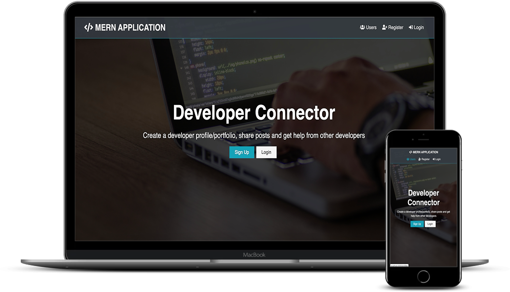

# Modern Technologies Used

-   VSCode Editor
-   ES6+ Syntax
-   Async / Await
-   React Hooks
-   Redux With DevTools
-   JWT (JSON Web Tokens)
-   Postman HTTP Client
-   Mongoose / MongoDB / Atlas
-   Bcrypt Password Hashing
-   Heroku & Git Deployment

[view DEMO](http://devsinfo.herokuapp.com)

